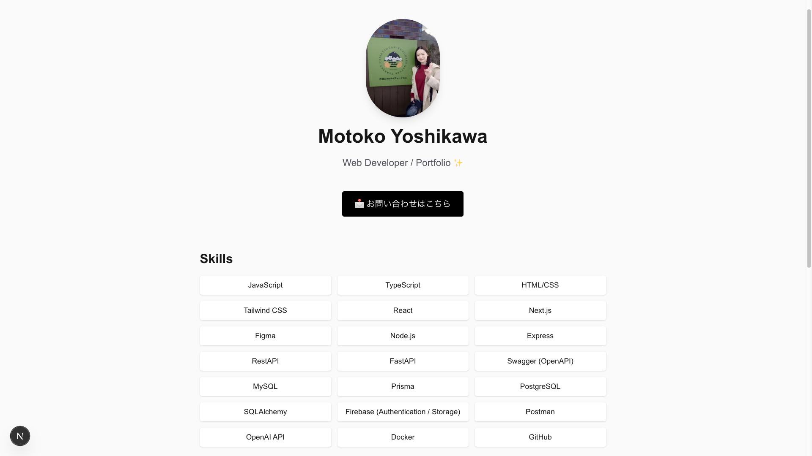
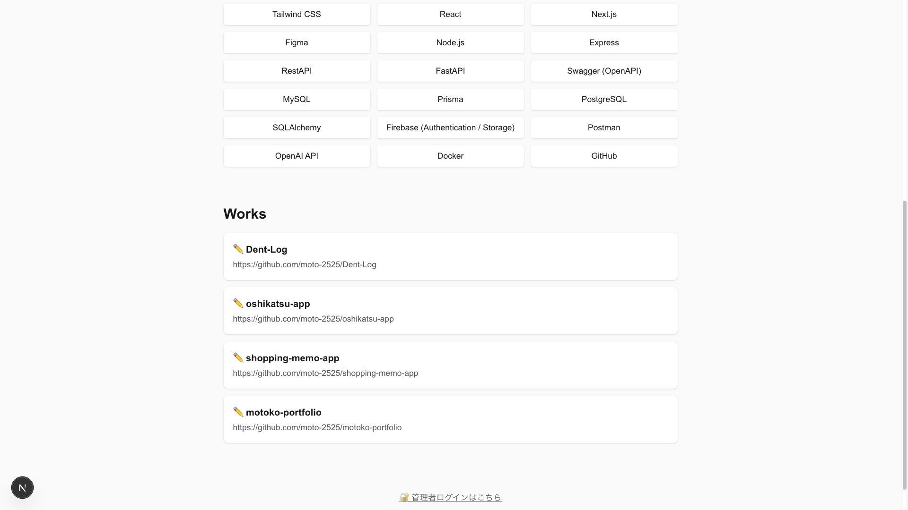
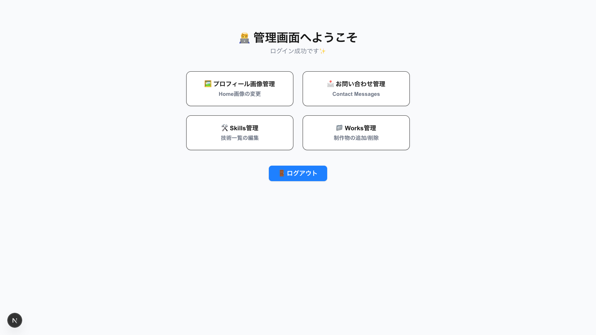
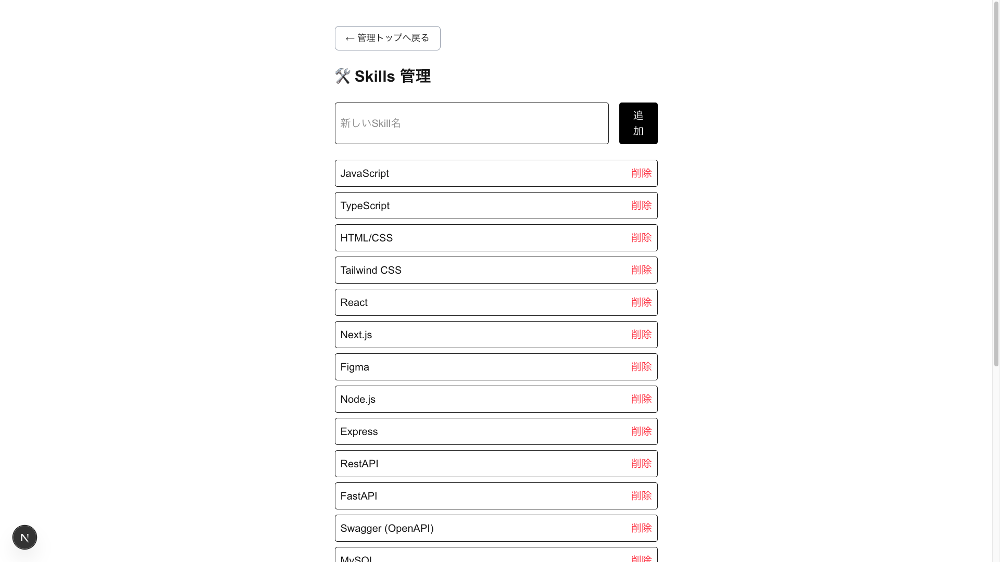
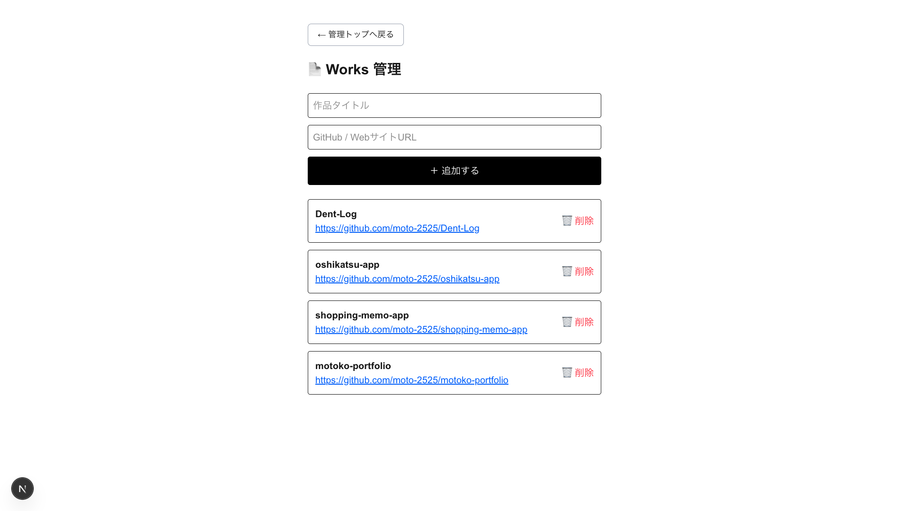

# motoko-portfolio

フルスタック（Frontend / Backend）で構築した個人ポートフォリオサイトです。  
管理画面から **Skills / Works / Profile / Contact** を編集できます。

---

## 🔗 URL

- Frontend: https://xxxx（デプロイ後に記載）
- Backend API: https://xxxx

---

## 🛠 技術スタック

### Frontend

- Next.js 16
- React
- TypeScript
- Tailwind CSS
- Firebase Authentication

### Backend

- Node.js
- Express
- Prisma
- MySQL
- REST API

### Tools / Others

- GitHub

---

## 🏠 Top Page

## 🛠 Skills

カテゴリ分けされた技術スタックを一覧表示しています。



---

## 📁 Works

GitHub リポジトリへのリンク付きで制作物を閲覧できます。



---

## 🔐 Admin Dashboard

Firebase Authentication を利用した管理画面です。



---

## ✏️ Skills Management

Skills の追加・削除が可能です。



---

## ✏️ Works Management

Works の追加・削除が可能です。



---

## ✨ Features

- 🔐 管理者ログイン（Firebase Auth）
- 🖼 プロフィール画像の変更
- 🛠 Skills / Works のCRUD管理
- 📩 お問い合わせ管理
- 🧩 Frontend / Backend 分離構成

---

## 🚀 Setup

### Frontend

```bash
cd frontend
npm install
npm run dev
```

### Backend

```bash
cd backend
npm install
npx prisma generate # Prisma Client を生成
npm run dev
```

---

## 🔐 Environment Variables

このプロジェクトでは環境変数を使用します。

### Frontend

```bash
cp .env.example .env.local
```

### Backend

```bash
cp .env.example .env
```

本プロジェクトでは `.env.example` を用意しており、
実際の機密情報は Git 管理対象外としています。必要な値を自身の環境に合わせて設定してください。

---

## 📝 補足

本プロジェクトは、
「**実際に運用・更新できるポートフォリオ**」を意識して設計しました。
